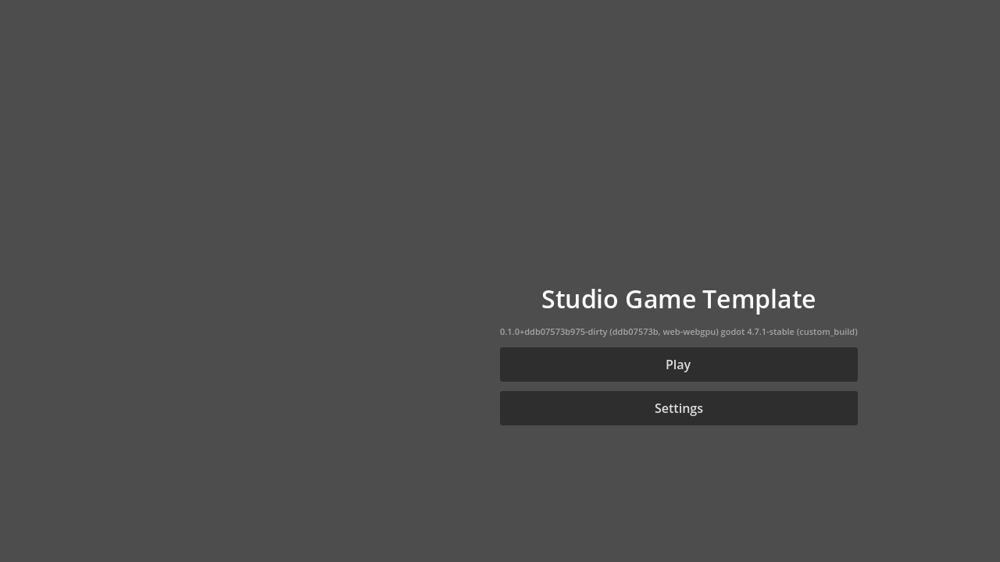

# Studio Foundation

Shared, open-source platform for building multiple first-class games — one shared
project per game — for **web (WebGPU + WebGL2 fallback), iOS, Android, Windows, Linux,
macOS, and dedicated servers**.

Engine: official **Godot 4.x** (pinned) + isolated WebGPU-fork export backend ·
Gameplay: **GDScript** · Assets: **Blender → glTF** pipeline · Backend: **Rust**
(Tokio/Axum/SQLx) · Persistence: **PostgreSQL** · Infra: **Docker Compose** · Tasks:
**just**.



> **Proof, not vaporware:** the image above is a real game rendering in a browser
> through this repo's own **Godot WebGPU 4.7.1 export backend** — ported forward,
> validated, and reproducible via `just engine-validate`. Beneath it, an
> authoritative Rust world-simulation settles shared gameplay events
> (mine → refine → build → battle → territory) into PostgreSQL. See
> [docs/strategy/AI_NATIVE_PLATFORM.md](docs/strategy/AI_NATIVE_PLATFORM.md) for the
> thesis and [BOOTSTRAP_REPORT.md](BOOTSTRAP_REPORT.md) for what verifiably works.

Read [GOAL.md](GOAL.md) first. Decisions live in [docs/adr/](docs/adr/). What
verifiably works today is in [BOOTSTRAP_REPORT.md](BOOTSTRAP_REPORT.md).

## Quickstart

```sh
git clone <this-repo> && cd studio-foundation
just doctor        # what's installed, what's missing, what's required vs optional
just bootstrap     # installs user-scope tools it safely can; prints manual steps
just services-up   # PostgreSQL via Docker Compose
just nakama-up     # optional public identity/RPC service + PostgreSQL dependency
just test          # Rust + Python + protocol + Nakama + Godot headless tests
# optional live authority proof: run `just asha-server`, then `just nakama-probe`
```

No `just`? Bootstrap directly: `powershell scripts/bootstrap.ps1` (Windows) or
`sh scripts/bootstrap.sh` (Linux/macOS/WSL2).

## Everyday commands

| Command | Purpose |
|---|---|
| `just doctor` | Environment report (required/optional/platform-specific, honest readiness) |
| `just test` / `just lint` | All fast tests / all linters |
| `just test-rust` `just test-godot` `just test-python` | Narrow suites |
| `just services-up` / `services-down` / `db-reset` / `db-seed` / `db-backup` | Local infra |
| `just nakama-build` / `nakama-test` / `nakama-up` | Nakama public identity/RPC runtime and service |
| `just asha-server` / `nakama-probe` | Run the private Rust authority and prove auth -> settlement -> idempotent replay |
| `just asset-validate FILE` / `asset-export FILE` / `asset-cook PROFILE` | Blender pipeline |
| `just godot-sync-addons` | Copy shared addon into game projects (run after addon edits) |
| `just export-browser-webgl [GAME]` | WebGL2 browser export (works with stock templates) |
| `just export-browser-webgpu [GAME]` | WebGPU export (needs fork templates: `just engine-build`) |
| `just run-browser-smoke` | Serve export + Playwright console-error smoke (Chrome/Edge) |
| `just NAME=my_game DISPLAY_NAME="My Game" new-game` | Generate a game from the template |
| `just engine-fetch` / `engine-build` | Reproduce engine artifacts from engine-lock.toml |
| `just engine-rebase --dry-run --json` | Inspect or prepare an isolated WebGPU-fork update worktree |
| `just benchmark-scene` | Run the finite Godot scene benchmark and emit structured metrics |
| `just visual-baseline` / `visual-compare` | Capture browser-rendered visual baselines and enforce pixel tolerances |
| `just release-validate --allow-dirty` / `sbom` / `audit` | Validate release policy, generate inventory, and query OSV |
| `just demo-connectivity` | Prove Godot → API → PostgreSQL and Godot → game-server connectivity |
| `just ci-local` | Run the same checks CI runs |

## Repository map

| Path | Contents |
|---|---|
| `engine/` | Engine pins (`engine-lock.toml`), patch series, fetch/build scripts. Engine source is cached out-of-tree, never committed. |
| `shared/godot-addons/studio_core/` | Reusable Godot addon: boot, logging, config, platform detection, render profiles, input, scenes, save, session, net transport, API client, i18n, a11y, audio/graphics settings, flags, manifests, seeded RNG, replay, dev console, perf overlay. |
| `shared/protocol/` · `shared/schemas/` · `shared/test-fixtures/` | Cross-language protocol spec + golden fixtures; JSON schemas (asset metadata, provenance). |
| `templates/godot-game/` | The game template: Godot project, server crate, asset dirs, docs, tests. |
| `services/` | Rust workspace: `shared-protocol`, `control-api`, `dedicated-server`, `admin-cli`, `integration-tests`, `world-sim`. |
| `tools/` | Asset pipeline, Blender scripts, doctor, generator, benchmark, release, screenshots, `studio-mcp`. |
| `infra/` | Docker Compose, Postgres init/seed, [Nakama authority bridge](infra/nakama/README.md), observability profile, environment models. |
| `tests/` | Browser (Playwright), integration, performance, protocol, visual regression. |
| `docs/` | Architecture, ADRs, agents, pipeline, browser/mobile, networking, performance, security, runbooks. |
| `games/` | Generated game projects (e.g. `games/sandbox`, the living example). |
| `.github/` | Thin CI workflows over `scripts/ci/`; issue/PR templates. |

## For AI agents

Start with [AGENTS.md](AGENTS.md) (Codex/Kimi) or [CLAUDE.md](CLAUDE.md) (Claude
Code); both defer to
[docs/agents/WORKING_AGREEMENTS.md](docs/agents/WORKING_AGREEMENTS.md). Reusable
skills are in [docs/agents/skills/](docs/agents/skills/). MCP setup (studio-mcp,
GitHub, Playwright): [docs/agents/mcp/](docs/agents/mcp/).

## Platform status (honest)

See [BOOTSTRAP_REPORT.md](BOOTSTRAP_REPORT.md) for the current evidence-backed matrix.
Nothing is claimed "supported" without a recorded test on real hardware — in
particular, Safari/iOS and WebGPU claims require real-device runs.

## License

**Platform (engine, tooling, infrastructure):** everything in this repository is
licensed under **both the MIT License and CC BY 4.0 simultaneously** — see
[LICENSE](LICENSE).

**Games:** content under [`games/`](games/) is **proprietary** (all rights
reserved) and is *not* covered by the platform's open license — see
[games/LICENSE](games/LICENSE).

Dependency licenses:
[docs/architecture/dependency-licenses.md](docs/architecture/dependency-licenses.md).
