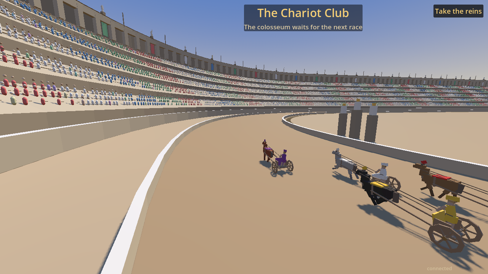
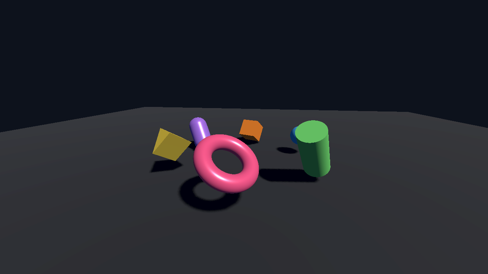

# Studio Foundation

**An AI-native, open-source game-dev toolkit — with a Godot 4.7.1 WebGPU browser
backend that actually renders 3D.**

Official [Godot](https://github.com/godotengine/godot) is the base and stays the
upstream. On top of it sits a WebGPU export path maintained as an ordered,
SHA-256-locked patch series, plus the MCP server, agent workflows, and asset
pipeline that make the whole thing drivable by AI assistants. WebGL 2 remains the
supported fallback.

### ▶ [Play it live — a Godot game running on WebGPU, in your browser](https://lxsolutions.github.io/studio-foundation/)

No install, no plugin. Needs a WebGPU-capable browser (Chrome/Edge 113+, Safari 26+,
Firefox on Windows); the page tells you if yours qualifies before you click. First load
takes roughly 15–30 seconds depending on your connection — most of it downloading the
~46 MB engine, not compiling shaders (pipelines build in about 2 seconds). It is
cached afterwards. Details: [webgpu-performance.md](docs/architecture/webgpu-performance.md).

[](https://lxsolutions.github.io/studio-foundation/)

***The Chariot Club*** *— a real game, not a test scene: a Roman colosseum with
crowded stands, chariot teams, and real-time shadows, rendered by Godot 4.7.1 through
WebGPU. Verified on an NVIDIA Tesla P40 at a locked 60 fps, ~490–630 draw calls and
~23M primitives per frame, with **0 `GPUValidationError`**. The published demo was
re-rendered from its own public URL on that GPU as a final check.*

<details>
<summary>Also published: a ~100-line minimal scene, for reproducing the render path from scratch</summary>

[](https://lxsolutions.github.io/studio-foundation/showcase/index.html)

[`webgpu_showcase.gd`](templates/godot-game/project/scenes/webgpu_showcase.gd) builds
six PBR meshes, a directional light, and real-time shadow mapping entirely in code with
no external assets — 59–60 fps, 36 draws/frame, 0 `GPUValidationError`. It exists so the
render path can be re-verified without any game content. Live at
[`/showcase/`](https://lxsolutions.github.io/studio-foundation/showcase/index.html).

</details>

## Our lane: AI-native, open-source game development

Godot does not accept AI-generated code contributions, and has stated it does not
intend to add AI features to the engine. That is a deliberate choice — and it
leaves an open lane. Studio Foundation takes it: building games **with** AI, in the
open, is the point of this toolkit, not a bolt-on.

The WebGPU backend is proof the model works: an AI-assisted capability the community
wanted for years, carried as a transparent patch series on official Godot (MIT) and
verified on real hardware. It could never land upstream under Godot's policy no
matter how well it works — so it lives here instead. The AI-native surface is
first-class throughout the repo, not just in the engine:

- **An MCP server** ([`tools/studio-mcp`](tools/studio-mcp), config in
  [`.mcp.json`](.mcp.json)) that exposes the toolkit to AI assistants and CLIs, with
  its own tests and a security boundary ([`studio_tools/mcp`](tools/pylib/studio_tools/mcp)).
- **Agent operating agreements** ([`AGENTS.md`](AGENTS.md), [`CLAUDE.md`](CLAUDE.md),
  [`docs/agents`](docs/agents)) so AI agents build, test, and verify against the repo
  predictably instead of ad hoc.
- **An AI-driven Blender asset pipeline**
  ([ADR 0006](docs/adr/0006-blender-master-asset-pipeline.md)).
- **Reproducible by construction** — every artifact is byte-and-SHA-256 pinned and
  every patch is checksum-locked, so "AI-built" never means "unauditable." You can
  rebuild and re-verify all of it yourself. That auditability is the whole answer to
  the slop critique.

Official Godot stays the upstream. We own the distribution, not the engine
([ADR 0008](docs/adr/0008-own-the-distribution-not-the-engine.md)).

## Quick start

Prerequisites are reported by `just doctor`. The fast repository checks require
Python 3.11; Godot and the engine toolchain are needed only for their suites.

```sh
git clone https://github.com/lxsolutions/studio-foundation.git
cd studio-foundation
just doctor
just bootstrap
just test
```

Without `just`, run `powershell scripts/bootstrap.ps1` on Windows or
`sh scripts/bootstrap.sh` on Linux, macOS, or WSL2.

### Use the WebGPU backend without building it

Prebuilt web export templates are published, so you can try WebGPU 3D without a
multi-hour engine build:

**[Download the templates](https://github.com/lxsolutions/studio-foundation/releases/tag/godot-4.7.1-webgpu-p0014)**
(official Godot 4.7.1 + patch series 0001–0014, single-threaded so exports run on plain
static hosts with no COOP/COEP headers). Point your `web` preset's
`custom_template/release` and `custom_template/debug` at them, then export with
`just export-browser-webgpu` — that step applies the WebGPU handoff the official editor
cannot emit, and skipping it produces a build that fails to start. Both files are
SHA-256 listed in the release notes and reproducible from source.

### Build the WebGPU path yourself

```sh
just engine-versions          # show the pinned commits and patch series
just engine-fetch             # clone official Godot, verify + apply the patches
just engine-build             # build the WebGPU export templates
just engine-validate
just export-browser-webgpu
```

The pipeline is deliberately split, so each stage is independently checkable:

```text
official Godot commit -> verified patch series -> release + debug WebGPU templates
    -> Godot export -> browser runtime probe -> visual evidence
```

`engine-build` requires the Emscripten version pinned in
[engine-lock.toml](engine/engine-lock.toml). Full procedure:
[the WebGPU runbook](docs/runbooks/godot-webgpu-update.md).

### Drive it with an AI assistant

The repo ships an MCP server, so an assistant can run the engine lifecycle, exports,
and checks directly. Point any MCP-capable client at [`.mcp.json`](.mcp.json) (Claude
Code picks it up automatically from the repo root), then see
[`docs/agents/mcp`](docs/agents/mcp) for the exposed tools and
[WORKING_AGREEMENTS.md](docs/agents/WORKING_AGREEMENTS.md) for how agents are expected
to work here.

## What is verifiable

| Capability | Evidence in this repository |
|---|---|
| Official engine base | Godot 4.7.1 stable is pinned by full commit in [engine-lock.toml](engine/engine-lock.toml) |
| WebGPU source | An ordered patch series in [engine/patches/](engine/patches/), each checked by SHA-256 before application |
| WebGPU toolchain | The exact Emdawn source and Dawn namespace backport are independently versioned and checksum-locked under [engine/toolchain/](engine/toolchain/) |
| Source preparation | `engine-fetch` clones official Godot only and creates a disposable patched worktree |
| Export templates | Accepted archives are recorded by filename, byte count, and SHA-256 in [engine-lock.toml](engine/engine-lock.toml) |
| Runtime verification | Browser smoke tests observe the engine's adapter, device, and WebGPU canvas requests and reject any WebGL context request |
| 3D shader translation | Verified in-browser on an NVIDIA Tesla P40. Patches 0009–0012 fix four distinct translation crashes; the runtime-specialized scene shader translates without crashing |
| WebGPU shader coverage | 177 of 182 engine shaders translate to valid WGSL offline. The 5 gaps are fundamental WGSL limits (subpass `input_attachment`, storage-texture format inference, vertex-stage `read_write` storage), not crashes |
| 3D render (lit + shadowed) | **Verified in-browser on an NVIDIA Tesla P40.** Patches 0013–0014 fix per-stage sampler visibility and depth-texture sampler types. A minimal PBR + shadow scene renders at 59–60 fps / 36 draws per frame, and a full game (The Chariot Club) holds a locked 60 fps at ~490–630 draws and ~23M primitives per frame — both with 0 `GPUValidationError` |
| Fallback | The same template project has an official WebGL 2 export preset |
| Template behavior | Headless GDScript tests cover the shared addon and neutral starter project |
| Optional services | Rust and Nakama components are independently tested and are not required for client-only use |

Exact test counts, artifact state, and unverified areas are in the
[verification report](BOOTSTRAP_REPORT.md).

## Status and honest limits

WebGPU support is **beta**.

What works, verified on real GPU hardware: the engine boots the WebGPU backend
(Forward Mobile), translates the runtime-specialized 3D scene shaders, and renders
lit, shadowed 3D geometry with 0 validation errors. 2D/UI renders and was gated
against the WebGL baseline at a 1.2% visual difference.

What does not, yet: several post-processing effects (tonemap variants, SSR, TAA,
SDFGI/voxel-GI debug views) still fail Tint translation *gracefully* — they are
skipped rather than crashing, so 3D renders without them. Getting to a visible frame
took fourteen patches worth of shader-translation and binding-description fixes; each
one is documented in [engine/patches/README.md](engine/patches/README.md) with the
exact defect it addresses.

Godot's own WebGPU support is separately in development upstream. This project is
not a competitor to that effort — it is a maintained, reproducible path that works
today on Godot 4.7.1, and it stays a patch series precisely so it can be retired
into upstream when upstream is ready.

The published demo downloads ~45 MB of engine (12 MB compressed) before it can draw.
Measured breakdown, and why that is mostly Godot rather than the WebGPU stack, is in
[WebGPU payload and startup](docs/architecture/webgpu-payload-and-startup.md).

Not yet claimed: Safari/iOS behavior and native Android/iOS device runs. The full list is in
[BOOTSTRAP_REPORT.md](BOOTSTRAP_REPORT.md); the running engineering log is in
[docs/architecture/webgpu-runtime-status.md](docs/architecture/webgpu-runtime-status.md).

Measured WebGPU-vs-WebGL 2 performance (same scene, same GPU) and per-game render
verification live in
[docs/architecture/webgpu-performance.md](docs/architecture/webgpu-performance.md).

## Included components

- A neutral Godot 4.7.1 project template and reusable `studio_core` addon.
- WebGPU export tooling with an official WebGL 2 fallback.
- Browser smoke, screenshot, visual-regression, benchmark, and release checks.
- An MCP server and agent workflow documentation.
- Blender-to-glTF validation and export tools.
- Optional Rust API/session scaffolding and PostgreSQL development setup.
- An optional Nakama adapter that forwards opaque application payloads without
  defining game mechanics.

The optional backend is scaffolding, not a required architecture. A consuming game
owns its content, rules, schemas, identity policy, persistence semantics, and
deployment.

## Repository layout

| Path | Purpose |
|---|---|
| `engine/` | Official Godot pin, WebGPU patches, build commands, and artifact records |
| `templates/godot-game/` | Mechanics-neutral Godot client and optional server template |
| `shared/godot-addons/studio_core/` | Reusable Godot services and platform interfaces |
| `services/` | Optional Rust protocol, session, API, and persistence scaffolding |
| `infra/` | Optional local PostgreSQL, Nakama, and tracing services |
| `tools/` | Engine, asset, export, browser, release, MCP, and repository tooling |
| `tests/` | Cross-language, browser, integration, performance, and visual checks |
| `docs/` | Decisions, architecture notes, and runbooks |

## Common commands

| Command | Purpose |
|---|---|
| `just test` / `just lint` | Run the fast test and lint suites |
| `just test-godot` / `test-rust` / `test-python` | Run one implementation suite |
| `just NAME=my_game DISPLAY_NAME="My Game" new-game` | Generate a neutral Godot project |
| `just export-browser-webgl [GAME]` | Export with official WebGL 2 templates |
| `just export-browser-webgpu [GAME]` | Export with the locally built WebGPU templates |
| `just run-browser-smoke` | Check browser boot, console output, canvas, and renderer |
| `just ci-local` | Run the full local acceptance suite |

Run `just` to list every supported command.

## Source and attribution

Official Godot is the sole active engine upstream. The WebGPU backend has
MIT-licensed historical lineage from `dwalter/godotwebgpu`; Studio Foundation
maintains the current Godot 4.7.1 patch series, build tooling, and validation surface
in this repository. The lineage repository is never cloned by the build.

See [NOTICE.md](NOTICE.md) and
[WebGPU integration provenance](docs/architecture/webgpu-integration.md) for the exact
source boundary and commit pins.

## Contributing and license

Material engine changes require tests, updated evidence, and the relevant ADR.
Contributor workflow is in
[WORKING_AGREEMENTS.md](docs/agents/WORKING_AGREEMENTS.md). Security scope and private
reporting instructions are in [SECURITY.md](SECURITY.md).

Foundation code, tooling, templates, documentation, and infrastructure are
dual-licensed under MIT and CC BY 4.0; see [LICENSE](LICENSE). Third-party attribution
is in [NOTICE.md](NOTICE.md) and
[dependency-licenses.md](docs/architecture/dependency-licenses.md).
