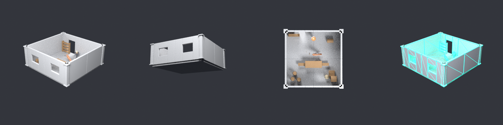
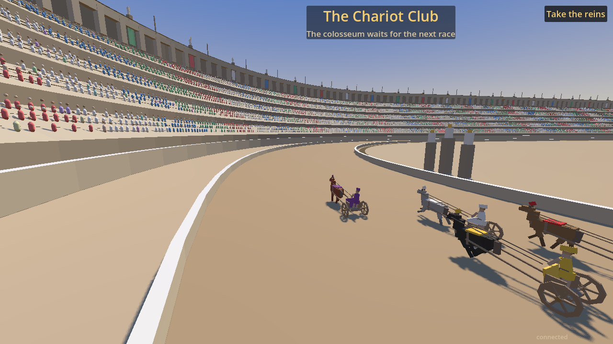
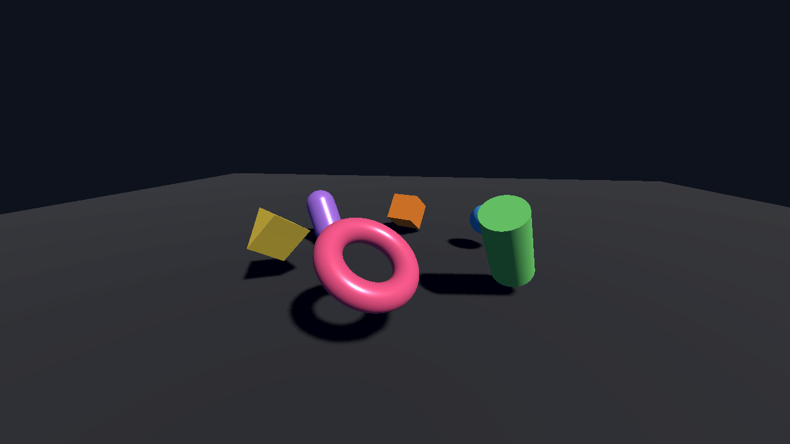

# Studio Foundation

**An AI-native, source-available game-dev toolkit: the deterministic asset
forge, the verification substrate, and the pipelines that let AI agents build,
prove, and ship real games — engine-neutral at the asset boundary (glTF/GLB
into Godot, Babylon.js, three.js), with Godot as the standardized runtime and
Rust services behind.**

The pillars:

- **bforge** — a deterministic headless-Blender asset forge for AI agents:
  138 whitelisted, typed operations with a quality gate that rejects output
  below the bar, byte-identical regeneration, and 228 bforge tests, 178 in suites that start a real Blender daemon.
- **Verification** — GLB budget gates, pixel-diff captures, provenance, and
  render probes, so agent output is measured rather than trusted.
- **Engine-neutral assets, standardized runtime** — the forge outputs portable
  glTF/GLB consumed by Godot, Babylon.js and three.js. Godot remains the
  standardized full runtime; promoting another runtime to peer status requires
  a separate accepted ADR (the TypeScript/Three.js proposal,
  [PR #50](https://github.com/lxsolutions/studio-foundation/pull/50), is still
  an open draft; [ADR 0018](docs/adr/0018-brief-to-battle-world-compiler.md)
  charts the World IR path), with Rust multiplayer services behind.

And as the standing proof that the model works at the hard end of the stack:
**a maintained Godot 4.7.1 WebGPU browser backend** — a checksummed
patch series on official Godot that renders Forward+ on real hardware, in
public, with the evidence committed.

> **Lineage.** The WebGPU backend builds on David Walter's MIT-licensed
> [`dwalter/godotwebgpu`](https://github.com/dwalter/godotwebgpu) driver (Godot
> 4.6.2); Studio Foundation maintains the 4.7.1 rebase, 33 targeted integration patches,
> the build tooling, and the browser validation evidence. Exact source
> boundary and commit pins:
> [webgpu-integration.md](docs/architecture/webgpu-integration.md), [NOTICE.md](NOTICE.md).

## The receipts, stated out loud

Critics say projects like this are marketing. Here is the inventory, with the
proof attached to every line. Hype is welcome here — it is earned.

**🥇 Godot's Forward+ renderer, running on WebGPU, reproducibly.** Not
the Mobile renderer: the full clustered desktop path — clustered lighting,
SSAO, volumetric fog — that AAA-feeling games actually need. Official Godot
ships no WebGPU support. Other public WebGPU patch stacks exist — including
the 4.6.2 driver this one descends from — but what is rare at any version is
the part we consider the actual product: 33 checksummed patches of named
engineering between "does not draw" and "renders at 60 fps on a Tesla P40 with
0 `GPUValidationError`", an evidence file that ties adapter, engine counters,
composited pixels and command-buffer validity together, and a one-command
reproduction path. Other implementations may exist; this one you can audit.
[Play it in your browser](https://lxsolutions.github.io/studio-foundation/).

**🔨 A deterministic, quality-gated Blender forge for AI agents.**
bforge is 138 typed, whitelisted operations driven into a persistent headless
Blender daemon — LODs, collision, budgets, rigs, gaits, baking, validation —
with byte-identical output run to run and 228 tests, 178 of them in suites that start a real Blender daemon.
No GUI remote-control, no arbitrary code execution, no "same
prompt, different mesh." We know of nothing else public that does all four of those.

**🛡 A toolchain that rejects its own output.** The quality gate measures
perceptual material separation (CIELAB ΔE), texel density, triangle budgets,
and set-level style conformance — and `export.asset` refuses below-bar
exports. This gate was not designed in a meeting: it exists because an
earlier agent shipped a character made of eight identical browns, we autopsied
it in public, and we made the failure unshippable. That is what engineering
around your own mistakes looks like.

**🐺 Characters and creatures that are actually rigged and animated.**
Humanoids at figure-drawing proportions with fitted armour, faces, and hands;
quadrupeds and hexapods with real footfall gaits — lateral-sequence walk,
diagonal trot, rotary gallop, tripod scuttle. Exported glTF skins and clips
are verified by parsing the file, not by trusting the log.

**📐 A concept-image pipeline with a fidelity score.** `image.to_mesh` turns
a 2D concept into a real extruded, UV'd, textured solid and reports the
silhouette IoU against the source — "how close is the model to the picture"
as a number, not a vibe.

**🎮 A real game, in production, today.** [Ashenward](https://platosplaza.com/spike/)
— built with this toolkit: the Gates to the Underworld standing at start,
every unit and monster rebuilt through the enforced loop as rigged 3D,
Mineralz-style swarm pressure with forced-march pacing, and a PBR-baked hero
landmark with high-to-low relief. 421 tests, CI green, hash-verified deploys
with atomic rollback. Play it, then tell us the pipeline doesn't work.

**📏 Verification instead of vibes.** GLB budget gates, pixel-diff capture
harnesses, render probes that answer "did it draw," provenance that
fingerprints any engine build, fresh-clone-green installs, and CI on both
repositories. When a measurement and a critic disagree here, the measurement
wins — a lesson the most public rival effort independently converged on
*after we published it*.

**🌐 The forge, live and public.** [forge-live](https://platosplaza.com/forge/)
— type a small brief in a web page and watch bforge build the asset in
seconds: contact sheet, the quality measurements in plain numbers, and the
real GLB orbiting in a Babylon preview with a download link. No signup, no
install, no GUI Blender anywhere in the loop. This is the pipeline,
operating in public, that the claims above describe.

**⚙ The doctrine, proven in public.** Generation is not the bottleneck;
judgement, integration, and iteration speed are. Everything in this list was
built by AI agents using these tools — the ultimate dogfood, running in the
open.

## bforge: the asset forge — deterministic, headless, quality-gated

Most Blender-AI integrations are remote controls for a GUI Blender: arbitrary
code into a live session, a different mesh every run, nothing CI can test.
**bforge inverts that** — a persistent headless Blender daemon driven through
138 whitelisted, typed, deterministic operations. Same params + same seed →
byte-identical GLB, forever. It is how this toolkit's games get their art, and
it works identically on a laptop, in CI, and on a headless build box.

[](tools/bforge/README.md)

**The receipts, all reproducible:**

- **It fixes real games' assets.** The Chariot Club's shipped track was a flat
  oval slab: 25,796 tris, 26 materials, no UVs. One bforge audit-and-rebuild
  pass: 14,084 tris, 11 draw calls, UVs everywhere, real architecture — driven
  from the game's own track spec so mesh and race maths cannot drift
  ([the build](games/chariot/art_source/build_hippodrome.py)).
- **Quality is measured, not claimed.** `check.materials` computes perceptual
  colour distance (CIELAB ΔE) across an asset's materials — the "8 materials,
  all the same brown" failure an earlier agent shipped is now an error-level
  gate finding, and `export.asset` refuses to export below the bar without an
  explicit override. `check.style`/`check.conformance` score set-level art
  direction and name the axis that breaks it.
- **A frozen public benchmark, not a self-grade.** `benchmarks/brief-to-asset`
  holds a frozen brief set and a model-neutral harness: any agent command
  answers the briefs, and the harness scores the compiled artifacts for
  validity, semantics, budget, and byte-identical determinism — regenerated
  and diffed in public CI. The scripted reference agent holds the 6/6
  baseline; models compete against the same gates, not against vibes.
  `benchmarks/brief-to-battle` is the world-level half: the frozen fortress
  battle brief compiles with proof, plays out deterministically, and scores
  navigation outcomes against the brief — never the agent's claims.
- **Characters and creatures, actually rigged and animated.** Humanoids at
  figure-drawing proportions with fitted armour (`char.outfit`), faces, hands;
  quadrupeds and hexapods with real footfall gaits — lateral-sequence walk,
  diagonal trot, rotary gallop, tripod scuttle. Exported glTF skins and clips
  are verified by parsing the file, not by trusting the log.
- **The agent can see and prove what it made.** Six-panel contact sheets
  (hero/front/side/top/wireframe/UV-checker), luminance and palette
  measurement, silhouette scoring, shared-scale and supersampled inventory
  icons plus ground-anchored directional sprite sheets, impostor sheets for distant
  LOD, and concept-image → extruded-mesh with a silhouette-IoU fidelity score.
- **228 tests, 178 of them in suites that start a real Blender daemon.** Schema,
  MCP protocol, and per-op integration — including byte-determinism asserted
  on exports.

Full reference: [`tools/bforge/README.md`](tools/bforge/README.md) ·
[`docs/bforge/OPS.md`](docs/bforge/OPS.md) · engine-neutral output (glTF) —
the same assets ship into Godot, Babylon.js and three.js.

> **What we do not claim.** Nobody's agents produce Call-of-Duty-photoreal
> humans today — the most public attempt self-scored 5.05/10 with mannequin
> characters, and its own postmortem converged on the same lessons this repo
> codified earlier (instruments over eyes; measurement over critics). bforge's
> target is stylized-good, budget-verified, regenerable art that a small team
> can actually ship — and a pipeline honest enough to say when it isn't there
> yet.


## The standing proof: Godot 4.7.1 on WebGPU

Everything above this section is the toolkit. This is what it looks like when
the toolkit is pointed at the hardest problem in the room — and it is here
because claims need a floor to stand on. Official
[Godot](https://github.com/godotengine/godot) is the base and stays the
upstream; the WebGPU export path below is maintained here as an ordered,
SHA-256-locked patch series. WebGL 2 remains the supported fallback.

**Stated plainly.** This build renders Godot's Forward+ renderer — the full
clustered desktop path — through WebGPU, in a browser tab, on real hardware,
with the evidence committed. Official Godot ships no WebGPU support at all
[by their own docs](https://docs.godotengine.org/en/latest/tutorials/export/exporting_for_web.html).
Other public WebGPU patch stacks exist, including the 4.6.2 driver this work
descends from; we claim no monopoly on the idea. What we do claim is the part
that matters for trust: an ordered, checksum-locked patch series, a render
probe that refuses to call a fallback adapter or a blank canvas success, and a
published evidence file you can regenerate. The version number will age; the
auditability will not.

**What it took to make 4.7.1 draw.** 33 targeted, checksummed patches, each
killing a distinct defect between "does not draw" and "renders": the
Tint/SPIR-V translation chain (texture lowering, storage-buffer access, image
ordering, volatile decoration), sampler/texture stage-visibility splits, lit
shadow sampler types, the storage texture formats Forward+ needs, a cluster
builder that does not rely on subgroup ops, integer texture sample types,
negative LOD clamps, view-invariant physical formats, the SSAO R8 interleave
fix, and the volumetric-fog dead sampler. Plus the harness that makes the
claim auditable: render probes that answer "did it draw" with
`GPUValidationError` counts and engine counters, provenance that identifies
any WebGPU build, and atomic, checksummed template installs.

**What it is for.** The same toolkit — the forge, the verification substrate,
and this rendering path — is the foundation being built so that AI agents can
develop AAA-feeling games that run in a browser tab. The receipts are already
public: the forge above, the gates below, and a live game in production
([Ashenward](https://platosplaza.com/spike/)). We are not backing off that
claim; we are building the substance that makes it ordinary.

### ▶ [Play it live — a Godot game running on WebGPU, in your browser](https://lxsolutions.github.io/studio-foundation/)

No install, no plugin. Needs a WebGPU-capable browser (Chrome/Edge 113+, Safari 26+,
Firefox on Windows); the page tells you if yours qualifies before you click. First load
takes roughly 15–30 seconds depending on your connection — most of it downloading the
~46 MB engine, not compiling shaders (pipelines build in about 2 seconds). It is
cached afterwards. Details: [webgpu-performance.md](docs/architecture/webgpu-performance.md).

[](https://lxsolutions.github.io/studio-foundation/)

***The Chariot Club*** *— a real game, not a test scene: a Roman colosseum with
crowded stands, chariot teams, and real-time shadows, rendered by Godot 4.7.1 through
WebGPU. Verified on an NVIDIA Tesla P40 at a locked 60 fps, ~490–630 draw calls and
~23M primitives per frame, with **0 `GPUValidationError`**. The published demo was
re-rendered from its own public URL on that GPU as a final check.*

> **What you can rebuild:** all of it. The engine and the patch series are
> checksum-locked, and both demos are now in this repository — the minimal scene below,
> and The Chariot Club itself under [`games/chariot/`](games/chariot). Note the game is
> published to make the demo reproducible and auditable, not to relicense it: per
> [`games/LICENSE`](games/LICENSE) a game directory without its own LICENSE stays all
> rights reserved. The Foundation itself (`engine/`, `tools/`, `shared/`, …) remains
> under the repository root LICENSE.

<details>
<summary>Also published: a ~100-line minimal scene, for reproducing the render path from scratch</summary>

[](https://lxsolutions.github.io/studio-foundation/showcase/index.html)

[`webgpu_showcase.gd`](templates/godot-game/project/scenes/webgpu_showcase.gd) builds
six PBR meshes, a directional light, and real-time shadow mapping entirely in code with
no external assets — 59–60 fps, 36 draws/frame, 0 `GPUValidationError`. It exists so the
render path can be re-verified without any game content. Live at
[`/showcase/`](https://lxsolutions.github.io/studio-foundation/showcase/index.html).

</details>


## Our lane: AI-native, source-available game development

Godot does not accept AI-generated code contributions, and has stated it does not
intend to add AI features to the engine. That is a deliberate choice — and it
leaves an open lane. Studio Foundation takes it: building games **with** AI, in the
open, is the point of this toolkit, not a bolt-on.

The WebGPU backend is proof the model works: an AI-assisted capability the community
wanted for years, carried as a transparent patch series on official Godot (MIT) and
verified on real hardware. It could never land upstream under Godot's policy no
matter how well it works — so it lives here instead. The AI-native surface is
first-class throughout the repo, not just in the engine:

- **An MCP server** ([`tools/studio-mcp`](tools/studio-mcp), config in
  [`.mcp.json`](.mcp.json)) that exposes the toolkit to AI assistants and CLIs, with
  its own tests and a security boundary ([`studio_tools/mcp`](tools/pylib/studio_tools/mcp)).
- **Agent operating agreements** ([`AGENTS.md`](AGENTS.md), [`CLAUDE.md`](CLAUDE.md),
  [`docs/agents`](docs/agents)) so AI agents build, test, and verify against the repo
  predictably instead of ad hoc.
- **An AI-driven Blender asset pipeline**
  ([ADR 0006](docs/adr/0006-blender-master-asset-pipeline.md)).
- **Reproducible by construction** — every artifact is byte-and-SHA-256 pinned and
  every patch is checksum-locked, so "AI-built" never means "unauditable." You can
  rebuild and re-verify all of it yourself. That auditability is the whole answer to
  the slop critique.

Official Godot stays the upstream. We own the distribution, not the engine
([ADR 0008](docs/adr/0008-own-the-distribution-not-the-engine.md)).


## Quick start

Prerequisites are reported by `just doctor`. The fast repository checks require
Python 3.11; Godot and the engine toolchain are needed only for their suites.

```sh
git clone https://github.com/lxsolutions/studio-foundation.git
cd studio-foundation
just doctor
just bootstrap
just test
```

Without `just`, run `powershell scripts/bootstrap.ps1` on Windows or
`sh scripts/bootstrap.sh` on Linux, macOS, or WSL2.

### Use the WebGPU backend without building it

Prebuilt web export templates are published, so you can try WebGPU 3D without a
multi-hour engine build:

**[Download the templates](https://github.com/lxsolutions/studio-foundation/releases/tag/godot-4.7.1-webgpu-p0033)**
(official Godot 4.7.1 + patch series 0001–0033, single-threaded so exports run on plain
static hosts with no COOP/COEP headers). These are the first templates that render
**Forward+** — the earlier `p0014` release cannot, and predates the nineteen patches
that made the clustered renderer work. Point your `web` preset's
`custom_template/release` and `custom_template/debug` at them, then export with
`just export-browser-webgpu` — that step applies the WebGPU handoff the official editor
cannot emit, and skipping it produces a build that fails to start. Both files are
SHA-256 listed in the release notes and reproducible from source.

Once the templates are in place, one command exports, serves, probes and traces
the build, then writes a single evidence file:

```sh
just verify-renderer --renderer forward_plus
```

It exits 0 only when a non-fallback GPU adapter, varied composited pixels and
non-zero engine draw counters all agree — and reports `inconclusive` rather than
a pass when it cannot establish those. **If your result differs from the
published one, please open an issue and attach the evidence file.** Independent
confirmation on hardware we do not own is the most useful contribution right now.

**What this download is not.** It is a beta pinned at patch series **0001–0033** —
the series whose Forward+ frame is hardware-verified — but the verification is
narrow: one scene class, one browser (headed Chrome), one OS, one GPU (an
NVIDIA Tesla P40). Three WebGPU validation errors remain outside the
presented-frame path, the uncompressed payload is about 46 MB, cold startup is
tens of seconds, and AMD, Intel, Apple, Safari, and iOS are unverified. If
your hardware differs from that matrix, run the probe above and send the
evidence file either way — that is how the matrix grows.

### Build the WebGPU path yourself

```sh
just engine-versions          # show the pinned commits and patch series
just engine-fetch             # clone official Godot, verify + apply the patches
just engine-build             # build the WebGPU export templates
just engine-validate
just export-browser-webgpu
```

The pipeline is deliberately split, so each stage is independently checkable:

```text
official Godot commit -> verified patch series -> release + debug WebGPU templates
    -> Godot export -> browser runtime probe -> visual evidence
```

`engine-build` requires the Emscripten version pinned in
[engine-lock.toml](engine/engine-lock.toml). Full procedure:
[the WebGPU runbook](docs/runbooks/godot-webgpu-update.md).

### Drive it with an AI assistant

The repo ships an MCP server, so an assistant can run the engine lifecycle, exports,
and checks directly. Point any MCP-capable client at [`.mcp.json`](.mcp.json) (Claude
Code picks it up automatically from the repo root), then see
[`docs/agents/mcp`](docs/agents/mcp) for the exposed tools and
[WORKING_AGREEMENTS.md](docs/agents/WORKING_AGREEMENTS.md) for how agents are expected
to work here.

## What is verifiable

| Capability | Evidence in this repository |
|---|---|
| Official engine base | Godot 4.7.1 stable is pinned by full commit in [engine-lock.toml](engine/engine-lock.toml) |
| WebGPU source | An ordered patch series in [engine/patches/](engine/patches/), each checked by SHA-256 before application. `just engine-verify-patches` re-checks the whole series — checksums, ordering, and that nothing on disk is unlocked — with no toolchain required |
| WebGPU toolchain | The exact Emdawn source and Dawn namespace backport are independently versioned and checksum-locked under [engine/toolchain/](engine/toolchain/) |
| Source preparation | `engine-fetch` clones official Godot only and creates a disposable patched worktree |
| Export templates | Accepted archives are recorded by filename, byte count, and SHA-256 in [engine-lock.toml](engine/engine-lock.toml) |
| Runtime verification | Browser smoke tests observe the engine's adapter, device, and WebGPU canvas requests and reject any WebGL context request |
| 3D shader translation | Verified in-browser on an NVIDIA Tesla P40. Patches 0009–0012 fix four distinct translation crashes; the runtime-specialized scene shader translates without crashing |
| WebGPU shader coverage | 199 of 205 shader modules translate to valid WGSL offline, with **0 GLSL compile failures**, measured at the engine's real target env (Vulkan 1.1 / SPIR-V 1.3 — the harness previously measured 1.0 and so did not reproduce the engine; see patch 0016). **None of the 6 remaining failures blocks Forward+ under WebGPU**: two are Forward Mobile's subpass tonemap, one is FSR's 16-bit variant (the driver reports no half-float, so the engine picks the fallback, which translates), two are the subgroup variants WebGPU does not select, one is an editor debug gizmo |
| Renderer ceiling | **Forward+ (clustered) renders on hardware** — verified in-browser on an NVIDIA Tesla P40 with the p0033 templates: 188 objects / 2,015,266 primitives at 59 fps, 0 invalid `commandEncoder.finish` out of 10,842, 0 rejected `queue.submit`, 0 bind-group failure classes. Forward Mobile remains an export option; WebGL 2 remains the fallback. Three validation errors outside the presented-frame path and the wider hardware matrix are the open work |
| 3D render (lit + shadowed) | **Verified in-browser on an NVIDIA Tesla P40.** Patches 0013–0014 fix per-stage sampler visibility and depth-texture sampler types. A minimal PBR + shadow scene renders at 59–60 fps / 36 draws per frame, and a full game (The Chariot Club) holds a locked 60 fps at ~490–630 draws and ~23M primitives per frame — both with 0 `GPUValidationError` |
| Compiled gameplay in the browser | `sim_kernel.wasm` imports nothing, so it instantiates inside a page whose main module is already Godot's — checked by `just sim-host-abi`, and replayed against golden state hashes in a real browser by `just sim-browser-host` (7 valid + 19 invalid conformance fixtures) |
| Engine-neutral presentation | The same kernel replay drives three.js, Babylon.js and PlayCanvas through one binding in `shared/runtime/`; all three must place every joint identically on every tick, headless — `just runtime-conformance` |
| Fallback | The same template project has an official WebGL 2 export preset |
| Template behavior | Headless GDScript tests cover the shared addon and neutral starter project |
| Optional services | Rust and Nakama components are independently tested and are not required for client-only use |

Exact test counts, artifact state, and unverified areas are in the
[verification report](BOOTSTRAP_REPORT.md).

## Status and honest limits

WebGPU support is **beta**.

What works, verified on real GPU hardware: the engine boots the WebGPU backend,
translates the shaders the runtime actually selects, and renders lit, shadowed
3D geometry with 0 validation errors — under **Forward Mobile**, and under
**Forward+** (the clustered desktop path) since patch series 0001–0033. 2D/UI
renders and was gated against the WebGL baseline at a 1.2% visual difference.

What does not, yet: several post-processing effects (tonemap variants, SSR, TAA,
SDFGI/voxel-GI debug views) still fail Tint translation *gracefully* — they are
skipped rather than crashing, so 3D renders without them. Three WebGPU validation
errors remain outside the presented-frame path. Getting here took 33 patches of
shader-translation, binding-description, and format-invariant fixes; each one is
documented in [engine/patches/README.md](engine/patches/README.md) with the
exact defect it addresses.

Godot's own WebGPU support is separately in development upstream. This project is
not a competitor to that effort — it is a maintained, reproducible path that works
today on Godot 4.7.1, and it stays a patch series precisely so it can be retired
into upstream when upstream is ready.

The published demo downloads ~45 MB of engine (12 MB compressed) before it can draw.
Measured breakdown, and why that is mostly Godot rather than the WebGPU stack, is in
[WebGPU payload and startup](docs/architecture/webgpu-payload-and-startup.md).

Not yet claimed: Safari/iOS behavior and native Android/iOS device runs. The full list is in
[BOOTSTRAP_REPORT.md](BOOTSTRAP_REPORT.md); the running engineering log is in
[docs/architecture/webgpu-runtime-status.md](docs/architecture/webgpu-runtime-status.md).

Measured WebGPU-vs-WebGL 2 performance (same scene, same GPU) and per-game render
verification live in
[docs/architecture/webgpu-performance.md](docs/architecture/webgpu-performance.md).

## C# on the web: what this does not fix, and what it does

A recurring question from teams arriving here: *would this have made Godot viable
for our C# client?* The honest answer has two halves, and the first is no.

```
export failed: cannot combine Mono runtime with the web platform
```

That error is not a missing template or a setting. A web export has exactly one
WebAssembly **main module** — the module owning runtime init, linear memory, and
the JS glue the page boots. Godot's Emscripten build is that module; the .NET
runtime is built to be that module too. Two runtimes, one slot.

**Nothing in this repository changes that.** The 33 patches change what Godot
*draws with*; not one touches module loading. A .NET client hits the same wall
here as on stock Godot, and a rendering fork mistaken for a runtime fix costs a
team weeks. `just export-browser-webgl` on a `.csproj` project now refuses with
that explanation rather than letting Godot deliver the cryptic version.

The second half: the requirement underneath C# — gameplay rules that are typed,
compiled, and *identical on client and server* — is met, by not entering the
argument over the slot at all. `services/sim-kernel` compiles to a **zero-import
reactor module**: it demands nothing of its host, so a running Godot web export
loads it beside its own module without either noticing. Godot stays GDScript and
observes kernel state through `StudioSimKernel`.

That property is enforced, not asserted — one `println!` would add a WASI import
and silently break it months later, in a browser, in someone else's product:

```sh
just sim-host-abi        # zero imports, exact reactor ABI, no start section
just sim-parity          # Python == native Rust == wasm, over the frozen corpus
just sim-browser-host    # the corpus replayed in a REAL browser, golden hashes
```

Full reasoning, and what this deliberately does not claim, in
[ADR 0019](docs/adr/0019-compiled-gameplay-on-the-web.md).

## Beyond Godot: what is actually engine-neutral

Most of the engineering here is not Godot engineering. bforge exports glTF that
Godot, Unity, Unreal, three.js, Babylon and PlayCanvas all read natively; the
deterministic kernel is renderer-independent by construction; World IR describes
what an entity *is* rather than what one engine calls it. Only the WebGPU patch
series is genuinely engine-specific.

That was also, until recently, unproven — and it mattered. The repository had one
renderer binding, in an untested HTML file, and it was wrong: it looked joints up
by instance name in a table keyed by part name, so the derived angle was always
exactly `0` and the gate leaves never moved through a replay in which the kernel
opens a gate from shut to fully open. The test covering it kept its only
assertion inside a branch that never held, and passed for two months. The binding
also rotated about **Y** while World IR declares the hinge axis as **Z**.

So presentation is now a data translation that lives in `shared/runtime/` and
holds no engine types — renderers apply instructions, they never derive them —
and the neutrality claim is checked by running it on more than one engine:

```sh
just runtime-contract      # the contract itself, no engine installed
just runtime-conformance   # three.js + Babylon + PlayCanvas on the same replay
```

The conformance suite drives the real kernel and requires all three renderers to
place every joint in the same world position on every tick, and requires hinges
to swing exactly when the kernel says their gate opened. All three run headless
with no GPU. Both suites fail if the rotation is forced to zero — verified by
mutation, not by inspection.

**What this does not claim:** that a whole game runs on three renderers (this is
the state-to-transform binding, not cameras, materials, input or physics); that
one GLB imports identically everywhere (glTF is the declared boundary, but no
test yet loads one asset into three engines); or that Unity, Unreal — or Godot —
implement this contract. Godot binds kernel state through GDScript instead, so
the reference client is currently the one engine outside the engine-neutral
layer. Reasoning and the measured engine differences are in
[ADR 0020](docs/adr/0020-engine-neutral-presentation.md).

## Included components

- A neutral Godot 4.7.1 project template and reusable `studio_core` addon.
- WebGPU export tooling with an official WebGL 2 fallback.
- Browser smoke, screenshot, visual-regression, benchmark, and release checks.
- An MCP server and agent workflow documentation.
- Blender-to-glTF validation and export tools.
- Optional Rust API/session scaffolding and PostgreSQL development setup.
- An optional Nakama adapter that forwards opaque application payloads without
  defining game mechanics.

The optional backend is scaffolding, not a required architecture. A consuming game
owns its content, rules, schemas, identity policy, persistence semantics, and
deployment.

## Repository layout

| Path | Purpose |
|---|---|
| `engine/` | Official Godot pin, WebGPU patches, build commands, and artifact records |
| `templates/godot-game/` | Mechanics-neutral Godot client and optional server template |
| `shared/godot-addons/studio_core/` | Reusable Godot services and platform interfaces |
| `services/` | Optional Rust protocol, session, API, and persistence scaffolding |
| `infra/` | Optional local PostgreSQL, Nakama, and tracing services |
| `tools/` | Engine, asset, export, browser, release, MCP, and repository tooling |
| `tests/` | Cross-language, browser, integration, performance, and visual checks |
| `docs/` | Decisions, architecture notes, and runbooks |

## Common commands

| Command | Purpose |
|---|---|
| `just test` / `just lint` | Run the fast test and lint suites |
| `just test-godot` / `test-rust` / `test-python` | Run one implementation suite |
| `just NAME=my_game DISPLAY_NAME="My Game" new-game` | Generate a neutral Godot project |
| `just export-browser-webgl [GAME]` | Export with official WebGL 2 templates |
| `just export-browser-webgpu [GAME]` | Export with the locally built WebGPU templates |
| `just run-browser-smoke` | Check browser boot, console output, canvas, and renderer |
| `just sim-host-abi` / `sim-parity` / `sim-browser-host` | Check the deterministic kernel stays host-independent, and agrees across Python, Rust, node, and a browser |
| `just runtime-contract` / `runtime-conformance` | Check the presentation binding, and that three renderers agree about it |
| `just ci-local` | Run the full local acceptance suite |

Run `just` to list every supported command.

## Source and attribution

Official Godot is the sole active engine upstream. The WebGPU backend has
MIT-licensed historical lineage from `dwalter/godotwebgpu`; Studio Foundation
maintains the current Godot 4.7.1 patch series, build tooling, and validation surface
in this repository. The lineage repository is never cloned by the build.

See [NOTICE.md](NOTICE.md) and
[WebGPU integration provenance](docs/architecture/webgpu-integration.md) for the exact
source boundary and commit pins.

## Contributing and license

Material engine changes require tests, updated evidence, and the relevant ADR.
Contributor workflow is in
[WORKING_AGREEMENTS.md](docs/agents/WORKING_AGREEMENTS.md). Security scope and private
reporting instructions are in [SECURITY.md](SECURITY.md).

This project is **source-available, not open source.** PolyForm Perimeter
restricts use in a competing product, which the Open Source Definition does not
permit, so calling it "open source" would be inaccurate. The source is public,
auditable, and free to build commercial games with — under the terms below.

Foundation code, tooling, templates, documentation, and infrastructure are
available under the **PolyForm Perimeter License 1.0.1** plus the Additional
Terms in [LICENSE](LICENSE): use it freely to build and sell games and assets,
credit Studio Foundation once per product ("Asset production powered in part
by bforge"), and do not offer a competing bforge product. Revisions published
before 2026-08-06 remain under their original MIT/CC BY 4.0 terms. Third-party
attribution is in [NOTICE.md](NOTICE.md) and
[dependency-licenses.md](docs/architecture/dependency-licenses.md).
