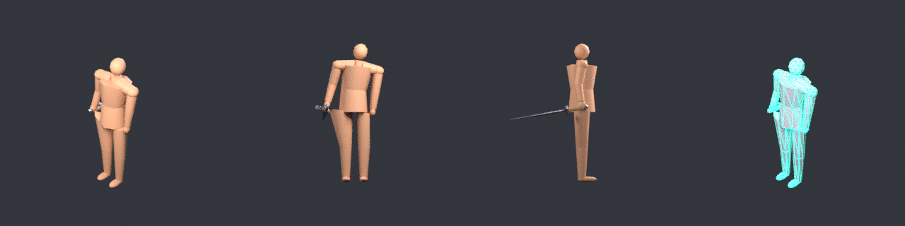
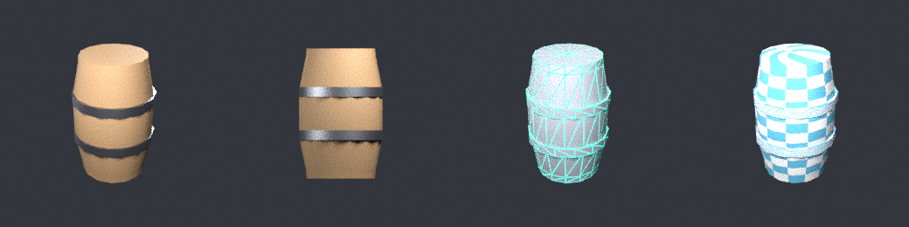
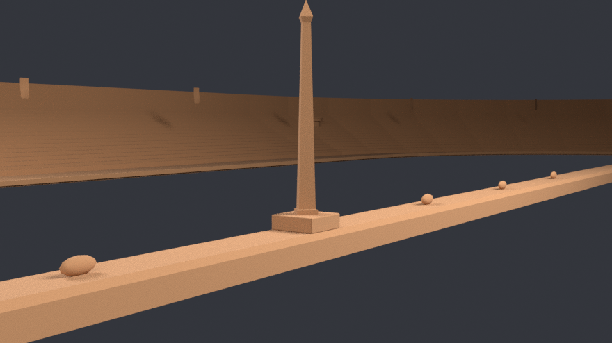
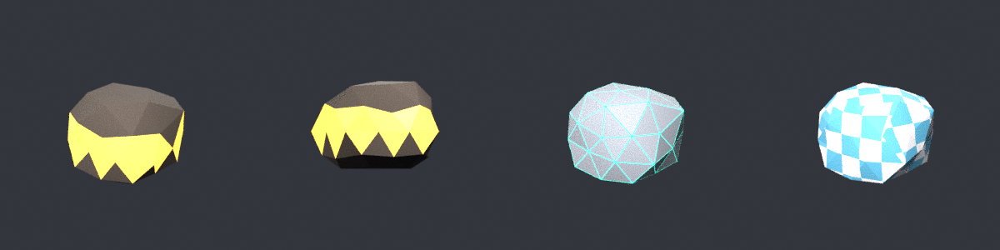

# bforge — a headless Blender asset forge for AI agents

`bforge` gives an AI agent the ability to author **game-ready** 3D assets:
props, modular building kits, terrain, rigged and animated characters,
materials, LODs, collision proxies and glTF exports — through a persistent
background Blender session with no GUI, no remote code execution, and
byte-identical output run to run.

```bash
python tools/bforge/bforge/cli.py doctor
python tools/bforge/bforge/cli.py make crate_a --recipe prop.crate --export
```

```python
from bforge import Forge
with Forge() as forge:
    forge.call("session.reset")
    forge.call("prop.barrel", name="barrel", height=1.1, bands=3, seed=7)
    forge.call("gameready.collision", name="barrel", mode="convex")
    forge.call("render.contact_sheet", out="barrel.png")   # look at it
    forge.call("export.asset", asset_id="barrel_a")        # .blend + .glb + .meta.json
```

All three images below were produced headlessly by the commands in this README —
no GUI, no human in Blender.

**A composed scene** (`tools/bforge/examples/tavern.py`) — 18 objects, 9,356
triangles, 7 materials, inside the `browser_webgpu` environment budget. Panels:
hero, low angle, top-down, wireframe.


**A rigged, animated, armed character** — 19-bone armature with a single `hips`
root, distance-falloff skinning, four clips, a dagger bone-parented to `hand_r`.
Verified by parsing the exported GLB: 1 skin, 19 joints, 4 animations.



**A single prop's review sheet** — hero, front ortho, wireframe (topology and
triangle spend), UV checker (stretch and texel density).



### In the studio's own games

**The Chariot Club** shipped a `colosseum_track.glb` that was a flat oval slab:
1,038 objects, 25,796 triangles, 12 materials, no UVs anywhere, and no building
around the racing surface. `session.import` + `check.critique` found that in one
pass. [`games/chariot/art_source/build_hippodrome.py`](../../games/chariot/art_source/build_hippodrome.py)
replaces it with a real circus — banked surface, rails, tiered cavea, arcade,
spina with obelisk, metae and lap-counting dolphins, corner towers, torches and
faction banners — driven entirely from the game's own `track_spec.json`, so the
mesh cannot drift from the race maths in `track_geometry.gd`.

| | before | after |
| --- | --- | --- |
| triangles | 25,796 | 14,084 |
| materials / draw calls | 12 | 11 (from 26, via `material.consolidate`) |
| file size | 1,630 KB | 763 KB |
| UVs | none | every surface |
| actual architecture | none | stands, spina, towers, banners |



**The Deep** got an 8-asset underground pack
([`games/asha_world/art_source/build_deep_pack.py`](../../games/asha_world/art_source/build_deep_pack.py)):
ore vein, crystal cluster, stalactite, pit-prop frame, mine cart, lantern,
rubble and drill head — 2,134 triangles for the whole set, each with a convex
collision proxy. It writes `.blend` masters and `.meta.json` sidecars into
`assets-source/`, so the assets go *through* the ADR 0006 pipeline rather than
around it: all 11 masters pass `just asset-validate`.



The ore seam is painted onto a band of the rock's own faces with
`material.face_assign` — zero extra triangles, impossible to bury inside the
rock, and it reads as "valuable" at 20 px tall.

---

## Why this exists

Every other Blender-AI integration is a **remote control for a GUI Blender**: a
socket add-on plus an `execute_blender_code` tool, with a few hundred low-level
wrappers around `bpy.ops` ("add cube", "set material", "bevel"). That design has
four problems that matter more the more you use it:

1. **It needs a GUI.** No CI, no containers, no headless build box, no remote
   GPU host. The one place you most want automated asset generation is the one
   place it cannot run.
2. **It is not reproducible.** Arbitrary generated Python against live scene
   state gives a different mesh every run, so nothing can be regression-tested
   or regenerated from source.
3. **It produces render assets, not game assets.** An LLM emitting raw `bpy`
   does not apply scale, does not chamfer, does not check texel density, does
   not make a collision proxy, and does not know that a procedural material
   cannot survive glTF. The output looks fine in a viewport screenshot and
   imports wrong.
4. **The agent cannot see what it made.** A single viewport grab is enough to
   notice a missing object and nothing else.

bforge inverts all four. It is a **whitelisted, headless, deterministic,
recipe-level** toolset with verification built into the loop — which is also
exactly what this repository's [ADR 0006](../../docs/adr/0006-blender-master-asset-pipeline.md)
already required of the asset pipeline.

| | Typical Blender MCP | bforge |
| --- | --- | --- |
| Needs GUI Blender running | yes | no |
| Works in CI / headless / over SSH | no | yes |
| Arbitrary code execution into Blender | yes (`execute_blender_code`) | no — allowlisted ops only |
| Reproducible output | no | yes, seeded and deterministic |
| Abstraction level | `bpy` primitives | game-asset recipes |
| Applies game-engine correctness | no | LODs, collision, budgets, pivots, UV validation |
| Agent can inspect its own output | one viewport grab | multi-view + wireframe + UV-checker contact sheet |
| Rigging / skinning / animation | GUI-dependent, usually absent | headless, verified through glTF |

---

## Architecture

```
tools/bforge/
  bforge/            HOST side — never imports bpy, stdlib only
    client.py          spawns and owns the Blender daemon, speaks the protocol
    cli.py             bforge command line
    mcp_server.py      MCP stdio server
    schema.py          catalog + MCP/OpenAI/Anthropic/markdown schema export
  runtime/           BLENDER side — runs inside `blender --background`
    daemon.py          JSON-line RPC loop
    registry.py        @op decorator: types, coercion, schema generation
    lib/               mesh, uvs, materials, scene-graph, finishing pass
    ops/               the 130 operations, grouped by namespace
  catalog.json       committed op snapshot (so tools/list needs no Blender)
  tests/             unit + live-integration + visual gallery
```

**A persistent daemon, not one process per call.** A cold `blender -b` costs
2–4 seconds. An agent iterating on a model does that dozens of times. Holding
one process open makes calls land in tens of milliseconds and — more
importantly — lets ops build on each other instead of every call starting from
an empty scene.

**Marker-framed protocol.** Requests are JSON lines on stdin; responses are
`@@BF@@ {json}` on stdout. Blender writes its own chatter to the same stdout and
always will, so the client scans for the marker rather than trusting line order.
stderr is drained on a background thread — without that, a chatty Blender fills
the pipe buffer and deadlocks, which looks exactly like "the model is thinking".

**One registry, four surfaces.** Each op declares its typed parameters once;
runtime coercion, MCP schemas, OpenAI/llama.cpp function schemas, CLI help and
the markdown reference are all generated from that single declaration.

---

## Connecting an agent

**MCP** (Claude Code, Claude Desktop, Codex, any MCP client). Already registered
in this repo's `.mcp.json`:

```json
{ "mcpServers": { "bforge": {
    "command": "uv",
    "args": ["run", "--project", "tools", "python", "tools/bforge/bforge/mcp_server.py"] } } }
```

Five tools by default — `bforge_ops`, `bforge_describe`, `bforge_run`,
`bforge_run_batch`, `bforge_session` — because 89 individual MCP tools swamps
most clients' tool lists. `bforge_run_batch` builds a whole asset in one round
trip. Pass `--tools full` to expose every op as its own MCP tool instead.

**llama.cpp / OpenAI-compatible / vLLM / any function-calling runtime:**

```bash
python tools/bforge/bforge/cli.py schema --format openai   > tools.json
python tools/bforge/bforge/cli.py schema --format anthropic > tools.json
```

Then route calls back through `Forge.call()`. Names are mangled to
`bforge_prop_crate` (dots are illegal in OpenAI function names);
`schema.from_openai_name()` maps them back.

**Claude Code skill:** `.claude/skills/bforge/SKILL.md`.

**Plain CLI / CI:** `bforge run`, `bforge script recipe.json`, `bforge make`.

---

## The loop that produces good assets

Generation alone is not the hard part. This is:

1. `session.reset`
2. a recipe (`prop.*`, `kit.*`, `env.*`, `char.*`) or a composition of `build.*`
3. **`render.contact_sheet` — and actually look at the PNG.** Six panels: hero,
   front, left, top, a wireframe pass, and a UV-checker pass. The wireframe
   shows triangles spent where they buy no silhouette. The checker shows UV
   stretch and texel-density mismatch. Neither is visible in a triangle count.
4. `check.critique` — numeric findings, each naming the op that fixes it
5. `gameready.review` — the quality gate: critique + material separation in
   one pass/fail. `export.asset` runs it by default (`gate=false` overrides),
   so a mud-blob of identical materials cannot ship by accident
6. `gameready.collision`, `gameready.lod`, `gameready.budget`
7. `export.asset` — `.blend` master + `.glb` + `.meta.json` + review sheet

Both halves matter. `check.critique` catches non-manifold edges and texel
mismatch that no render shows; the contact sheet catches "the proportions are
wrong" that no metric shows.

---

## What it can make

130 ops across 19 namespaces. Full reference: [`docs/bforge/OPS.md`](../../docs/bforge/OPS.md).

- **`prop.*`** — crate, barrel, chest, sack, rock, crystal, tree, pillar, torch,
  fence, furniture, weapon, banner, debris
- **`kit.*`** — modular pieces on a snap grid, a full texel-consistent kit, and
  assembled rooms with cut door and window openings
- **`env.*`** — fBm terrain (hills/mountains/plateau/dunes/island), cliffs,
  water, roads draped onto terrain, surface scatter, complete arenas
- **`char.*`** — humanoid blockouts at real figure-drawing proportions, fitted
  armatures with distance-falloff skinning, keyframed idle/walk/run/attack/
  jump/death/wave clips, bone attachment for weapons — plus **`char.outfit`**
  (fitted cuirass/pteruges/greaves/bracers/helmet/shield, bone-parented,
  materials distinct by construction), **`char.face`** and **`char.hands`**, and
  **`char.creature`** + **`char.creature_rig`** for quadrupeds (canine/equine/
  feline/generic plans) with walk/trot/gallop/graze gait tables
- **`paint.*`** — vertex-colour wear: fill, height gradients (dust/snow/waterline),
  cavity/edge grime from geometry, deterministic noise. Exports as glTF COLOR_0
- **`morph.*`** — shape keys (inflate/dent/flatten/taper/bulge) with keyframable
  weights, exported as glTF morph targets and morph animations
- **`build.*`** — parametric primitives, lathe, loft, greeble, extrude, bevel,
  array, mirror, deform, and **`build.sweep`**: a cross-section along a path
  (oval / circle / line / arc / custom), which is how racetracks, grandstands,
  roads, ramparts, rails and tunnels get made. Frames use parallel transport, so
  a closed loop does not twist.
- **`material.*` / `uv.*`** — PBR presets, procedural node graphs, bake-to-texture,
  box/cylinder/smart unwrapping, lightmap channels, texel-density reports
- **`gameready.*`** — LOD chains, collision proxies, platform budgets, atlasing,
  pivots, attachment sockets
- **`render.*` / `check.*` / `export.*`** — contact sheets, turntables,
  **`render.camera`** (explicit position/target/lens, because auto-framing is
  useless on a 700 m stadium), **`render.impostor`** (billboard sprite sheets +
  normal sheets + JSON sidecar — the distant-LOD technique), studio validation,
  critique, **`check.materials`** (perceptual material separation, the mud-blob
  detector), silhouette scoring, gated glTF/blend/meta export
- **`session.import`** — pull in an existing GLB/glTF/OBJ/FBX/blend to inspect,
  critique, fix or extend assets a game already ships. This is how the Chariot
  audit above was done.

---

## Design rules

- **Metres, always.** Scene units are metric with scale 1.0, enforced at reset.
- **Deterministic.** Same params + same seed → same mesh, including vertex
  order. Environment noise is built from `sin`/`cos` rather than a platform
  noise library so CI can regenerate an asset and diff it.
- **No `bpy.ops` for geometry.** Operators depend on selection and context state
  that behaves differently in background mode. Geometry goes through `bmesh` and
  the data API. The few unavoidable operator calls (UV unwrap, bake, glTF
  export, armature edit mode) are isolated and known to work headless.
- **Every asset gets the finishing pass** — weld, shade, unwrap, material,
  origin, apply transforms — in that order, because each step depends on the
  last. Recipes do not get to skip it.
- **Advice, not silent failure.** Over budget, overlapping UVs, an unbaked
  procedural material, a saturated scatter: each returns a note saying what is
  wrong and which op fixes it. Only things that would actually corrupt an import
  are hard errors.

---

## Known constraints

- **Renders use Cycles on CPU.** EEVEE and Workbench need a live GPU context;
  in background mode without a display server they do not raise, they
  segfault. The wireframe pass is therefore a Cycles `ShaderNodeWireframe`
  material rather than a viewport overlay, which is why it works identically on
  a laptop, in CI and on a headless build box. `engine="eevee"` is available
  and opt-in where a GPU context exists.
- Contact sheets cost a few seconds. Use `tile=300, samples=16` while
  iterating.
- Scene state lives in the daemon. If it dies, state is lost — rebuild from
  `session.reset`. The client detects the death, reports Blender's stderr tail,
  and restarts on the next call.
- Blender is GPL-2.0-or-later and is used strictly as a standalone tool, never
  linked against. Generated `.blend`/`.glb` content is not GPL-derived
  (ADR 0006, ADR 0013).

---

## The bench — the loop as a public number

[`bench.py`](bench.py) runs the whole loop out loud: five briefs (a prop, a
synthesized-gait wolf, an armored warden that walks, a whole camp, a 2D
concept) each forged, quality-gated, exported, and parsed back for structure
— then publishes [`bench/SUMMARY.md`](bench/SUMMARY.md). Rerun it and diff:
the numbers come from the runner, never from memory.

## Testing

```bash
just bforge-test        # schema + MCP protocol (fast, no Blender)
just bforge-test-live   # 100+ live Blender integration tests
just bforge-gallery     # regenerate the visual review gallery
```

`test_forge.py` skips cleanly when Blender is absent or `BFORGE_SKIP_LIVE` is
set, so CI without Blender stays green. `test_schema.py` asserts that every op
has a summary and every parameter has a description — an undocumented parameter
is invisible to a model, so it is treated as a test failure.

After adding or changing an op, regenerate the committed catalog:

```bash
python tools/bforge/bforge/cli.py catalog --refresh --reference docs/bforge/OPS.md
```

A live test fails if `catalog.json` is stale.
